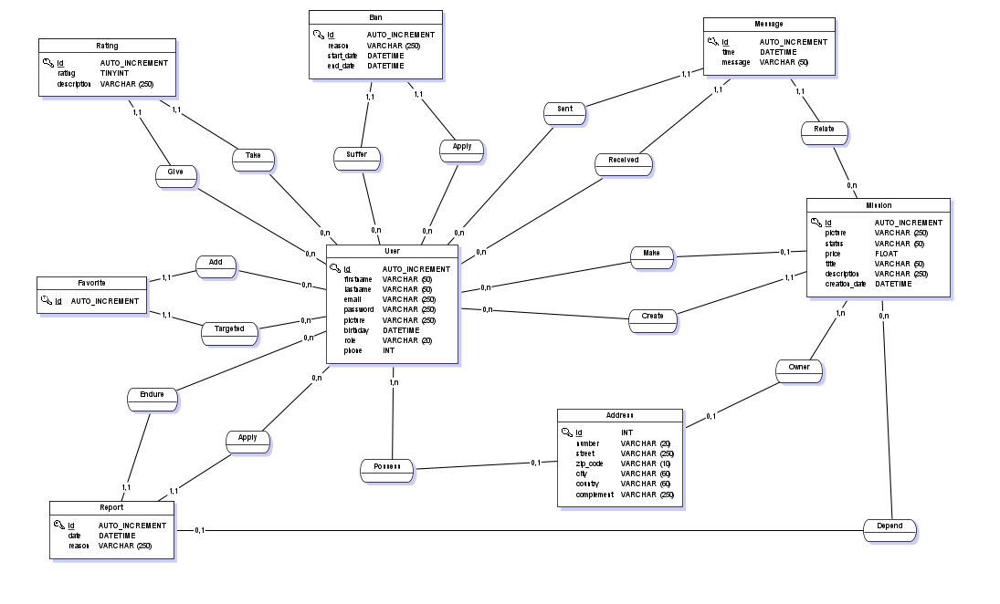
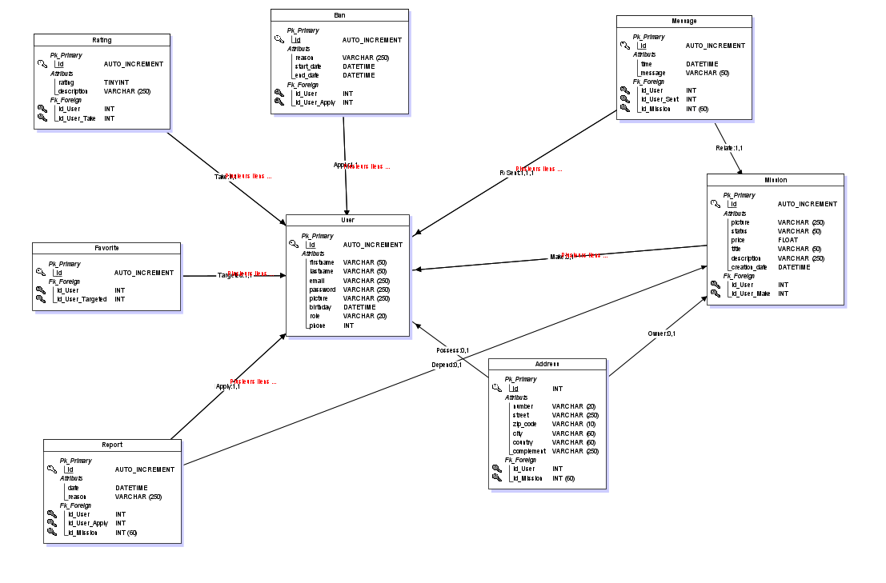

# Do It 4 Me - BackEnd

## Technologies

  - NodeJs 17.4.0
  - TypeScrypt 4.8.4	
  - TypeOrm 0.3.10
  - BCrypt 5.1.0
  - Jwt-simple 0.5.6
  - ExpressJs 4.16.1
  - Mysql
  - Jest 29.2.1

## Installation

Clone the Github repository

Install the packages:
```shell
npm install
```

Create .env file :

```
DB_HOST = 'localhost'
DB_USER = 'username'
DB_PASSWORD = 'password'
DB_PORT = '3306'
DB_NAME = 'database'
DB_CONNECTION_LIMIT = '4000'
APP_PORT = '3000'

SECRET_KEY_JWT = 'yourSecretKey'
ALGO_TOKEN_DECODE = 'HS512'
TOKEN_DURATION = 7200000
REFRESH_TOKEN_DURATION_IN_MS = 10800000
```

## Database installation
Create MySql database named like your DB_NAME in .env file.

follow the link to find the sql file ==>
<a href="./src/data" target="_blank">data.sql</a>

run it in your mysql database

## Start

```shell
npm run dev
```
Open to 
http://localhost:8000/
if this one is already occupied, it will start on
http://localhost:3000/

Use Postman to create your first user
````Json
{
  "firstname": "John",
  "lastname": "Doe",
  "email": "johndoe@example.com",
  "password": "yourPassword",
  "picture": "image.png", //Can be null
  "birthday": "1990-03-01",
  "role": "admin",
  "phone": "0600000000"
}
````

## Test

```shell
npm run test
```

## Conception
### MCD 



### MLD 


